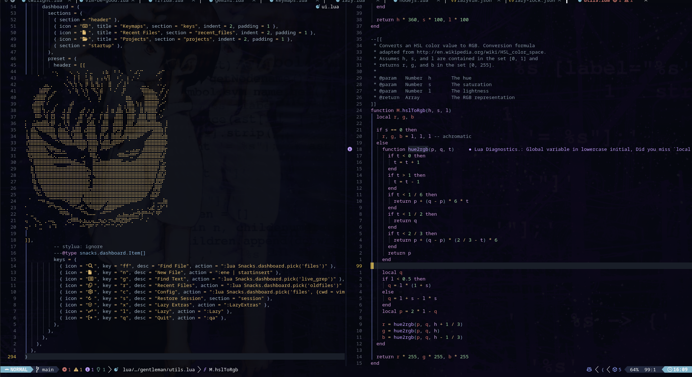

<div align="center">

# Anideout's Neovim Config

**Una configuración de Neovim personalizada, rápida y con estilo — basada en [LazyVim](https://lazyvim.github.io/)**

[](https://neovim.io/)
[](https://www.lua.org/)
[](https://lazyvim.github.io/)
[](LICENSE)

</div>

---

## Preview

<div align="center">

###Dashboard


> *El dashboard con el logo ASCII personalizado y accesos rápidos a proyectos*

### Editor en Acción


> *Vista dividida: configuración de avante.nvim (izquierda) y oil.nvim (derecha), con LSP activo*

</div>

---

##  Características

-  **Carga rápida** — 11/66 plugins cargados en ~52ms gracias a [Lazy.nvim](https://github.com/folke/lazy.nvim)
-  **AI integrado** — [avante.nvim](https://github.com/yetone/avante.nvim) para asistencia con IA directamente en el editor
-  **File explorer estilo buffer** — [oil.nvim](https://github.com/stevearc/oil.nvim) para navegar y editar el sistema de archivos
-  **Estética personalizada** — Logo ASCII animado en el dashboard
-  **Búsqueda poderosa** — Telescope para Find File, Find Text, Recent Files
-  **LSP completo** — Diagnósticos, autocompletado y navegación de código
-  **DB UI** — Integración con bases de datos incluida
-  **Multi-lenguaje** — Soporte para Lua, PHP, Python y más

---

## Estructura del Proyecto

```
~/.config/nvim/
├── init.lua              # Punto de entrada
├── lazy-lock.json        # Versiones fijas de plugins
├── lazyvim.json          # Configuración base de LazyVim
├── stylua.toml           # Formato de código Lua
├── db_ui/                # Configuraciones de base de datos
├── spell/                # Diccionarios de ortografía
└── lua/
    └── plugins/          # Configuraciones de plugins personalizadas
        ├── avante.lua    # AI assistant (yetone/avante.nvim)
        ├── oil.lua       # File manager (stevearc/oil.nvim)
        └── ...
```

---

## Plugins Destacados

| Plugin | Descripción |
|--------|-------------|
| [avante.nvim](https://github.com/yetone/avante.nvim) | Asistente de IA integrado en el editor |
| [oil.nvim](https://github.com/stevearc/oil.nvim) | Explorador de archivos como buffer editable |
| [Telescope](https://github.com/nvim-telescope/telescope.nvim) | Búsqueda fuzzy ultra rápida |
| [Lazy.nvim](https://github.com/folke/lazy.nvim) | Gestor de plugins con carga perezosa |

---

## Instalación

> Requiere **Neovim >= 0.9** y **Git**

```bash
# Hacer backup de tu configuración actual (si tienes)
mv ~/.config/nvim ~/.config/nvim.bak

# Clonar este repositorio
git clone https://github.com/Anideout/nvim ~/.config/nvim

# Abrir Neovim — los plugins se instalan automáticamente
nvim
```

Al abrir Neovim por primera vez, Lazy.nvim descargará e instalará todos los plugins automáticamente.

---

## ⌨️ Keymaps Principales

| Tecla | Acción |
|-------|--------|
| `ff` | Buscar archivo |
| `n` | Nuevo archivo |
| `g` | Buscar texto |
| `r` | Archivos recientes |
| `c` | Abrir configuración |
| `s` | Restaurar sesión |
| `x` | Lazy Extras |
| `l` | Lazy (gestor de plugins) |
| `q` | Salir |

---

## Referencias

- [LazyVim Docs](https://lazyvim.github.io/)
- [Neovim Docs](https://neovim.io/doc/)
- [avante.nvim](https://github.com/yetone/avante.nvim)
- [oil.nvim](https://github.com/stevearc/oil.nvim)

---

<div align="center">

Hecho con love por [Anideout](https://github.com/Anideout)

</div>
